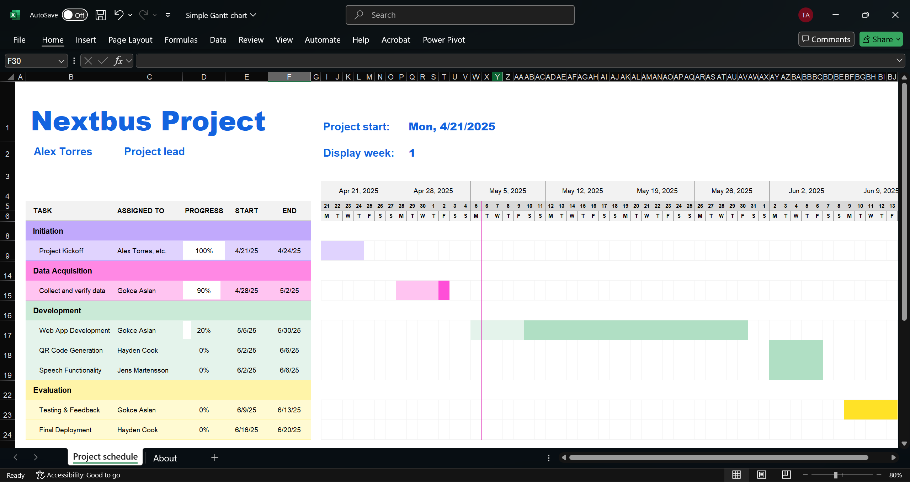
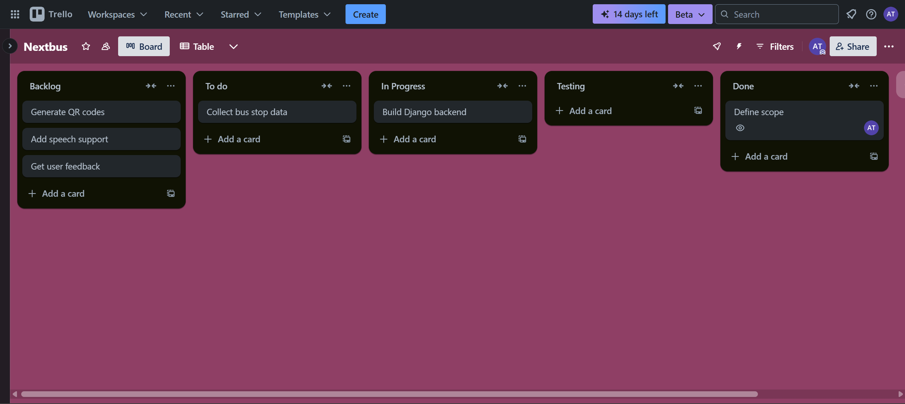

# Nextbus Project

## 1. Work Breakdown Structure (WBS)

### WBS Outline

**Level 1: Project – Community Transit Web App**  
 ├── **1.1 Initiation**  
 │  ├── 1.1.1 Define project goals  
 │  ├── 1.1.2 Identify stakeholders  
 │  └── 1.1.3 Scope documentation  
 ├── **1.2 Data Acquisition**  
 │  ├── 1.2.1 Meet with Community Transit  
 │  ├── 1.2.2 Collect route and stop data  
 │  └── 1.2.3 Verify data accuracy  
 ├── **1.3 Web App Development**  
 │  ├── 1.3.1 Design UI wireframes  
 │  ├── 1.3.2 Backend integration with Django  
 │  ├── 1.3.3 Schedule filtering logic  
 │  └── 1.3.4 Testing features  
 ├── **1.4 QR Code Deployment**  
 │  ├── 1.4.1 Generate unique QR codes  
 │  ├── 1.4.2 Map codes to stop data  
 │  └── 1.4.3 Print and distribute QR codes  
 ├── **1.5 Speech Functionality**  
 │  ├── 1.5.1 Research TTS libraries  
 │  ├── 1.5.2 Integrate API for language detection  
 │  └── 1.5.3 Test multilingual output  
 ├── **1.6 Testing and Feedback**  
 │  ├── 1.6.1 Recruit pilot testers  
 │  ├── 1.6.2 Collect user feedback  
 │  └── 1.6.3 Refine UI and features  
 └── **1.7 Final Deployment**  
   ├── 1.7.1 Launch server  
   ├── 1.7.2 Final documentation  
   └── 1.7.3 Project closure report  

### WBS Explanation
The WBS breaks the project into logical phases, starting from initiation and moving through data collection, system development, testing, and deployment. Tasks are grouped by deliverables and aligned with project milestones. This hierarchical structure helps track dependencies, assign responsibilities, and set a clear workflow.

---

## 2. Gantt Chart

| Task Name | Start Date | End Date | Duration | Dependencies |
|----------|------------|----------|----------|--------------|
| Project Kickoff | Apr 21 | Apr 25 | 5 days | — |
| Data Acquisition | Apr 28 | May 2 | 5 days | Kickoff |
| Web App Development | May 5 | May 30 | 4 weeks | Data Acquisition |
| QR Code Generation | Jun 2 | Jun 6 | 1 week | Development |
| Speech Functionality | Jun 2 | Jun 6 | 1 week | Development |
| Testing & Feedback | Jun 9 | Jun 13 | 1 week | QR & Speech |
| Final Deployment | Jun 16 | Jun 20 | 1 week | Testing |

### Gantt Summary
This timeline prioritizes core functionality (app and data) before enhancements (QR, TTS). Testing comes after all key features are developed. Dependencies ensure no task begins without the necessary input. The 10-week timeline is achievable and highlights critical paths for delivery.

---

## 3. Kanban Board

### Columns
- **Backlog**
- **To Do**
- **In Progress**
- **Testing**
- **Done**

### Example Tasks by Status

| Task | Status | Assignee |
|------|--------|----------|
| Define scope | Done | Project Owner |
| Collect bus stop data | To Do | Community Transit Rep |
| Build Django backend | In Progress | Developer |
| Generate QR codes | Backlog | Developer |
| Add speech support | Backlog | Developer |
| Get user feedback | Backlog | Tester |

### Kanban Summary
The Kanban board provides a live view of project progress. It highlights bottlenecks (e.g., tasks stuck in "In Progress") and balances workloads across team members. It's especially useful for managing iterative improvements during development and testing.
