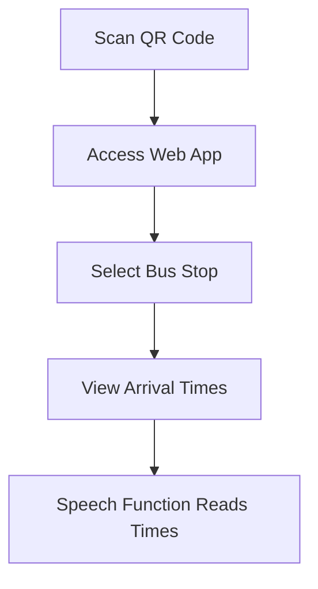
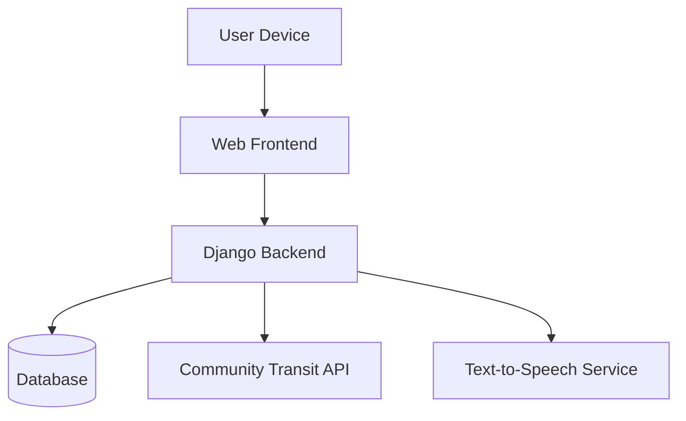
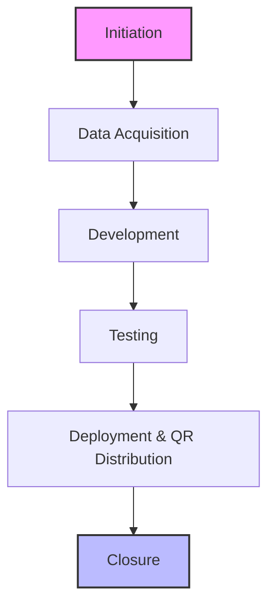
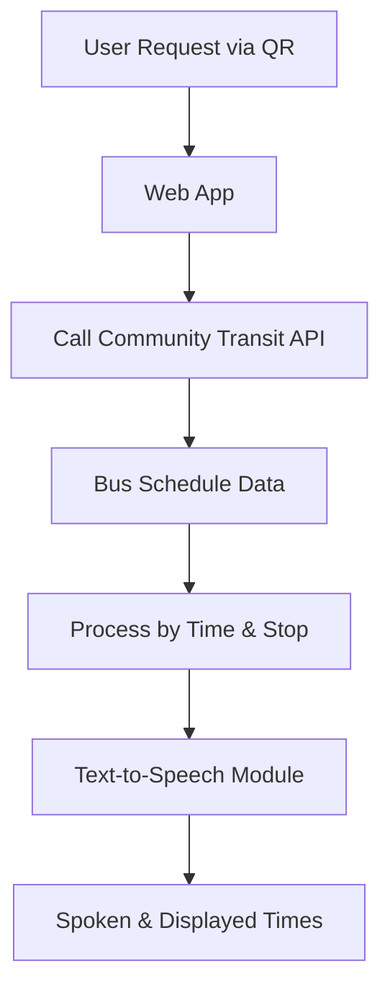
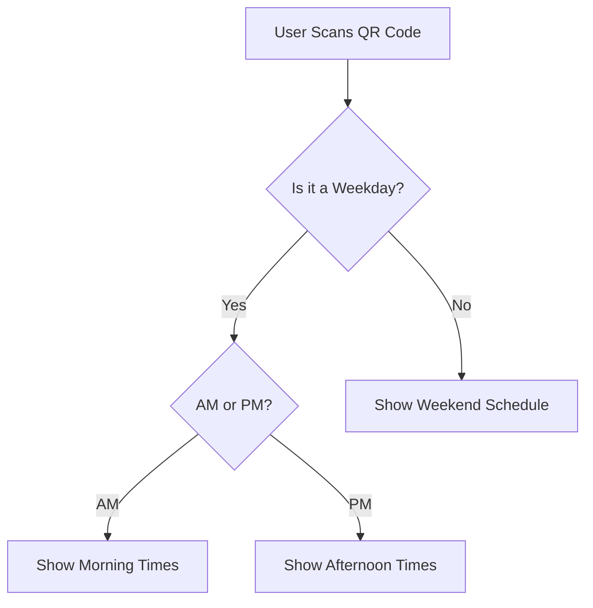
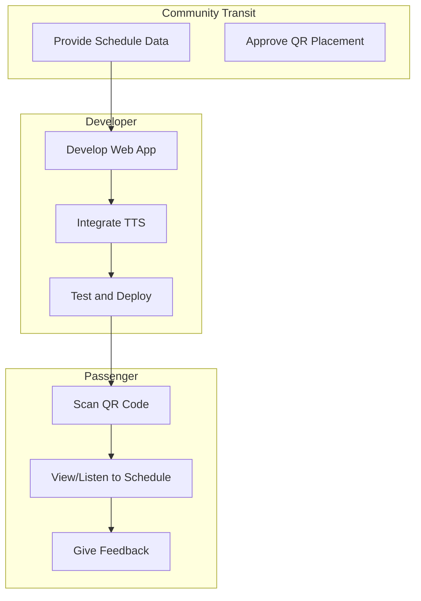

# Flow Charts for `nextbus`: Community Transit Web App

This document presents six distinct flow charts that represent different aspects of the `nextbus` project, a real-time bus schedule web application. Each chart provides unique insight into how the project is structured and how its components interact, from workflows to data flow, decision logic, and team responsibilities.

---

## 1. Basic Flow Chart

### Description:
This chart provides a high-level overview of the core user interaction with the `nextbus` application. It simplifies the experience from scanning the QR code to receiving spoken schedule information.

**Why This Format:**
This format is ideal for visualizing the sequential experience of the user. It helps focus on the user journey without diving into backend complexities.

---

## 2. System Flow Chart

### Description:
This chart outlines the key components of the system architecture: the front end, the back end (Django), external APIs, and the database.

**Why This Format:**
It clearly illustrates how system components communicate. This is useful for developers and stakeholders to understand infrastructure dependencies.

---

## 3. Workflow Diagram

### Description:
This chart outlines the project workflow from initiation to closure, including who is responsible for each phase.

**Why This Format:**
It shows the entire project lifecycle in a way that matches project management practices, highlighting the order and ownership of each step.

---

## 4. Data Flow Chart

### Description:
This chart shows how schedule and user data flow within the system, from request to delivery, including transformation points like text-to-speech.

**Why This Format:**
This emphasizes how data is collected, filtered, and transformed within the system. It helps ensure data is handled efficiently and accurately.

---

## 5. Decision Flow Chart

### Description:
This chart focuses on how the application determines what schedule data to show based on conditions like day, time, and location.

**Why This Format:**
The decision tree clearly outlines conditional logic. It's helpful for debugging logic and ensuring that different schedule types are correctly handled.

---

## 6. Swimlane Flow Chart

### Description:
This chart breaks down responsibilities across stakeholders—Developer, Community Transit, and Passengers.

**Why This Format:**
Simulated swimlanes clarify how tasks move across roles. It's especially useful for understanding collaboration and responsibility distribution.

---

# ✅ Conclusion

These six charts provide a comprehensive look at the `nextbus` web app from various analytical lenses: process, system, data, decision, responsibility, and workflow. They aid in both planning and presenting the project, ensuring it is understandable to stakeholders, developers, and testers alike.
